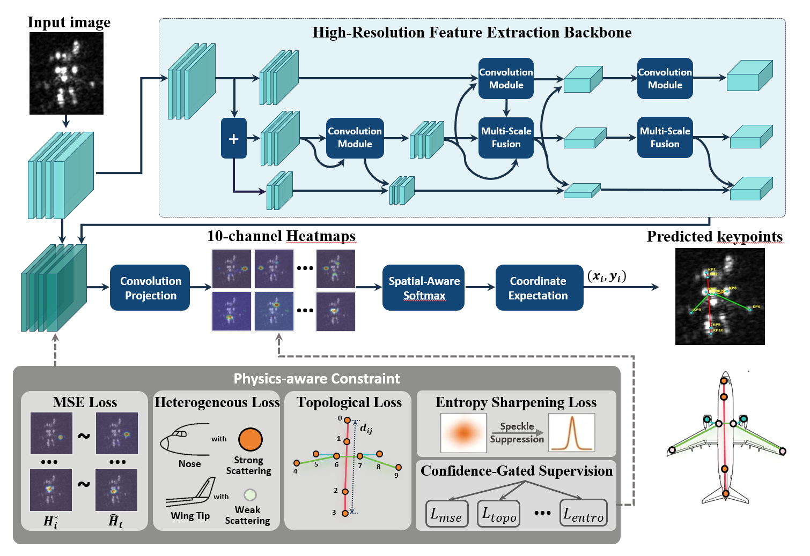

# S³U-SAR: Physics-Driven Semantic Scattering Structure Understanding of Aircraft Target in SAR Images

This repository is the official implementation of:

**Physics-Driven Semantic Scattering Structure Understanding of Aircraft Target in SAR Images**

S³U-SAR establishes a physical-semantic representation paradigm for SAR aircraft interpretation. Instead of representing aircraft targets as unordered local scattering responses, the proposed framework parses a SAR aircraft image into semantic scattering keypoints, visibility-aware attributes, and a physics-constrained structural topology.

> Code, dataset, and pretrained models will be released upon acceptance.

## Overview

Synthetic aperture radar (SAR) aircraft targets usually appear as sparse and discontinuous scattering responses due to coherent electromagnetic imaging. Conventional scattering-center-based representations are unordered and component-agnostic, making them unstable for fine-grained aircraft understanding.

S³U-SAR introduces:

- **Semantic scattering keypoints** to associate local electromagnetic responses with physically meaningful aircraft components.
- **Visibility-aware attributes** to distinguish scattering-salient, scattering-degraded, and semantically invalid responses.
- **Physics-constrained topology** to organize keypoints into a stable rigid-body structure.
- **Physics-guided supervision** to incorporate scattering heterogeneity, rigid-body topology, speckle uncertainty, and confidence-gated optimization.

## Framework

  

## Dataset: KP-SAR-Aircraft-1.0

We construct **KP-SAR-Aircraft-1.0**, a fine-grained benchmark for semantic scattering structure understanding of SAR aircraft targets.

The dataset provides:

- SAR aircraft target chips from Gaofen-3 imagery
- 10 semantic scattering keypoint annotations
- Visibility-aware attributes
- Physics-constrained topology definitions
- Aircraft category labels
- Orientation annotations

The dataset will be available sooner.
